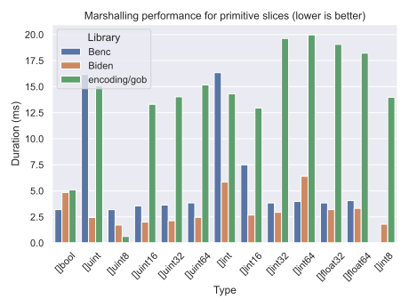
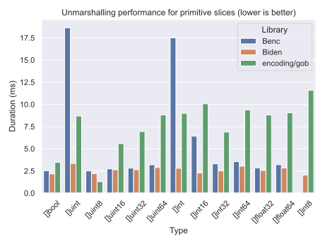

$$\LARGE {\color{white}\textrm{bi}}{\color{gray}\textrm{nary~}}{\color{white}\textrm{d}}{\color{gray}\textrm{ata~}}{\color{white}\textrm{en}}{\color{gray}\textrm{coder}} $$

<div align="center">
    
    &nbsp;&nbsp;
    
</div>

<div align="center">
    
</div>

<div align="center">
    Biden (baɪ̯dən) provides low-level facilities for converting between Go's primitive types and binary data streams.
</div

<hr />

## 📦 Getting started

### Installation

```bash
go get -u github.com/DasPoet/biden
```

### Usage

```go
package main

import (
	"fmt"
	"reflect"

	"github.com/daspoet/biden/pkg/biden"
)

func main() {
	var (
		values      = []uint32{1, 1, 2, 3, 5, 8, 13, 21, 34, 55}
		description = "These are the Fibonacci numbers."
	)

	encoded := marshal(values, description)
	decodedValues, decodedDescription := unmarshal(encoded)

	fmt.Println(reflect.DeepEqual(decodedValues, values))
	fmt.Println(decodedDescription == description)
}

func marshal(values []uint32, description string) []byte {
	var size int

	// find out how big our buffer needs to be
	size += biden.SliceBytes(values, biden.Uint32Bytes)
	size += biden.StringBytes(description)

	buf := make([]byte, size)

	var pos int

	pos = biden.MarshalSlice(pos, buf, values, biden.MarshalUint32)
	pos = biden.MarshalString(pos, buf, description)

	return buf
}

func unmarshal(encoded []byte) ([]uint32, string) {
	var pos int

	decodedValues, pos := biden.UnmarshalSlice(pos, encoded, biden.UnmarshalUint32)
	decodedDescription, pos := biden.UnmarshalString(pos, encoded)

	return decodedValues, decodedDescription
}
```

## 🚀 Benchmarks

There are several libraries that cover the same usecase as `biden`. `biden` was written to offer the best possible performance. To test whether it is any faster than competing alternatives, this repository contains a number of benchmarks. Their results are displayed below. If you are choosing this library for reasons related to performance, be sure to verify the results of these benchmarks in your own execution environment. Don't just believe things people are saying on the internet. If you find any mistakes in any of the code in this repository (including the benchmarks), please open an issue.

The benchmarks compare `biden` to:

* [benc](https://github.com/deneonet/benc)
* [encoding/gob](https://pkg.go.dev/encoding/gob)

If you feel like we should include any other repository in this list, please suggest an addition by opening an issue.

### Marshaling



### Unmarshaling



